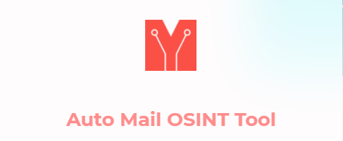
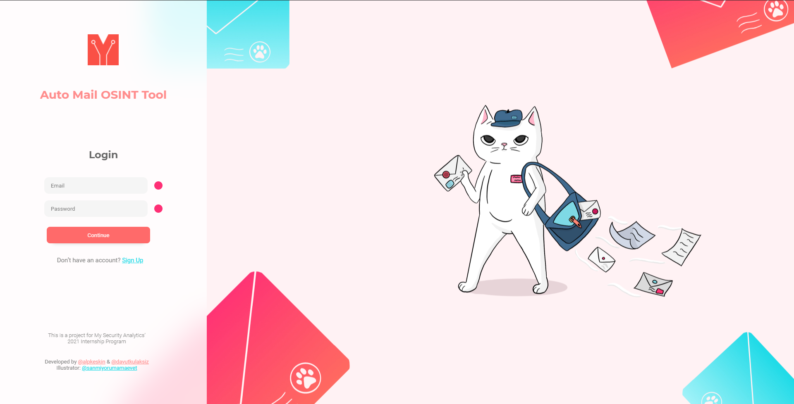
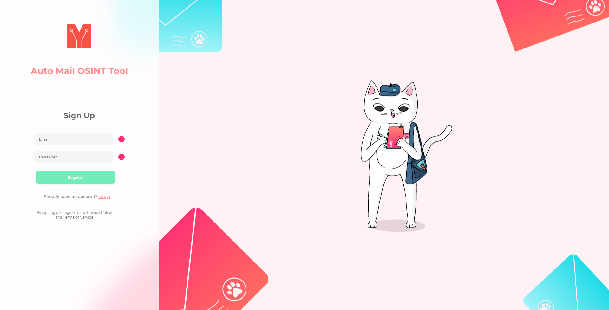
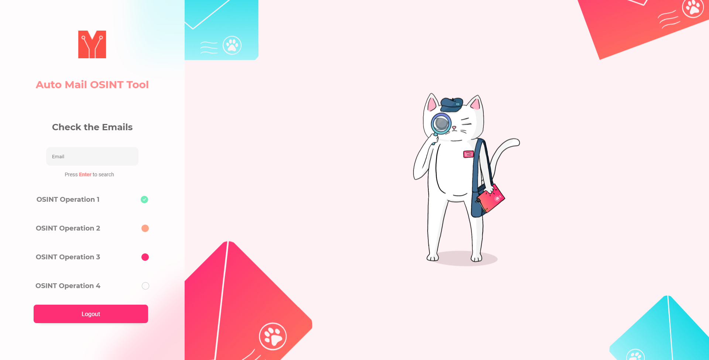

# **Auto Mail OSINT - WEB**

This is an open source project that developed by [Alp Keskin](https://github.com/alpkeskin) and [Davut Kulaksız](https://github.com/davutkulaksiz) within the scope of <b>My Security Analytics 2021 Summer Internship Program</b>. This repository is the web part of this project.

## Functionality

Auto Mail OSINT searches the web and checks if an email is registered to a specific website like <b>Instagram, Twitter, etc.</b>

<i>More methods are in development.</i>

To learn more about the back-end part, check out the [API Repository](https://github.com/mysecurityanalytics/auto-mail-osint-api).

# Frontend Part

## Tools:
   

<b>Figma</b> is used to create design library which contains indivudual components, page designs and system relations.

<b>Procreate</b> is used by [Karma Tülek](https://www.instagram.com/sanmiyorumamaevet/) to create the illustrations.

## Languages:

  

Client-side is made by <b>React</b> while connecting to back-end with <b>[FastAPI](https://fastapi.tiangolo.com/)</b>.

Also <b>[mongoDB](https://www.mongodb.com/)</b> is used for the database operations in the back-end.

# Screenshots

## Login Screen

## Signup Screen

## OSINT Screen (still in development)

